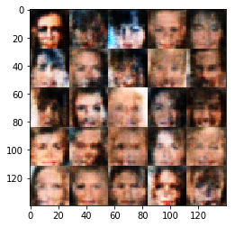
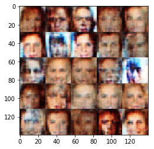
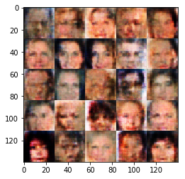

# Face Generation
In this project, you'll use generative adversarial networks to generate new images of faces.
### Get the Data
You'll be using two datasets in this project:
- MNIST
- CelebA

Since the celebA dataset is complex and you're doing GANs in a project for the first time, we want you to test your neural network on MNIST before CelebA.  Running the GANs on MNIST will allow you to see how well your model trains sooner.

If you're using [FloydHub](https://www.floydhub.com/), set `data_dir` to "/input" and use the [FloydHub data ID](http://docs.floydhub.com/home/using_datasets/) "R5KrjnANiKVhLWAkpXhNBe".


```python
#data_dir = './data'

# FloydHub - Use with data ID "R5KrjnANiKVhLWAkpXhNBe"
data_dir = '/input'


"""
DON'T MODIFY ANYTHING IN THIS CELL
"""
import helper

#helper.download_extract('mnist', data_dir)
helper.download_extract('celeba', data_dir)
```

    Found celeba Data


## Explore the Data
### MNIST
As you're aware, the [MNIST](http://yann.lecun.com/exdb/mnist/) dataset contains images of handwritten digits. You can view the first number of examples by changing `show_n_images`. 


```python
show_n_images = 25

"""
DON'T MODIFY ANYTHING IN THIS CELL
"""
%matplotlib inline
import os
from glob import glob
from matplotlib import pyplot

mnist_images = helper.get_batch(glob(os.path.join(data_dir, 'mnist/*.jpg'))[:show_n_images], 28, 28, 'L')
pyplot.imshow(helper.images_square_grid(mnist_images, 'L'), cmap='gray')
```


    <matplotlib.image.AxesImage at 0x7f55f781e320>


### CelebA
The [CelebFaces Attributes Dataset (CelebA)](http://mmlab.ie.cuhk.edu.hk/projects/CelebA.html) dataset contains over 200,000 celebrity images with annotations.  Since you're going to be generating faces, you won't need the annotations.  You can view the first number of examples by changing `show_n_images`.


```python
show_n_images = 25

"""
DON'T MODIFY ANYTHING IN THIS CELL
"""
mnist_images = helper.get_batch(glob(os.path.join(data_dir, 'img_align_celeba/*.jpg'))[:show_n_images], 28, 28, 'RGB')
pyplot.imshow(helper.images_square_grid(mnist_images, 'RGB'))
```


    <matplotlib.image.AxesImage at 0x7f55f77596d8>


## Preprocess the Data
Since the project's main focus is on building the GANs, we'll preprocess the data for you.  The values of the MNIST and CelebA dataset will be in the range of -0.5 to 0.5 of 28x28 dimensional images.  The CelebA images will be cropped to remove parts of the image that don't include a face, then resized down to 28x28.

The MNIST images are black and white images with a single [color channel](https://en.wikipedia.org/wiki/Channel_(digital_image%29) while the CelebA images have [3 color channels (RGB color channel)](https://en.wikipedia.org/wiki/Channel_(digital_image%29#RGB_Images).
## Build the Neural Network
You'll build the components necessary to build a GANs by implementing the following functions below:
- `model_inputs`
- `discriminator`
- `generator`
- `model_loss`
- `model_opt`
- `train`

### Check the Version of TensorFlow and Access to GPU
This will check to make sure you have the correct version of TensorFlow and access to a GPU


```python
"""
DON'T MODIFY ANYTHING IN THIS CELL
"""
from distutils.version import LooseVersion
import warnings
import tensorflow as tf

# Check TensorFlow Version
assert LooseVersion(tf.__version__) >= LooseVersion('1.0'), 'Please use TensorFlow version 1.0 or newer.  You are using {}'.format(tf.__version__)
print('TensorFlow Version: {}'.format(tf.__version__))

# Check for a GPU
if not tf.test.gpu_device_name():
    warnings.warn('No GPU found. Please use a GPU to train your neural network.')
else:
    print('Default GPU Device: {}'.format(tf.test.gpu_device_name()))
```

    TensorFlow Version: 1.1.0
    Default GPU Device: /gpu:0


### Input
Implement the `model_inputs` function to create TF Placeholders for the Neural Network. It should create the following placeholders:
- Real input images placeholder with rank 4 using `image_width`, `image_height`, and `image_channels`.
- Z input placeholder with rank 2 using `z_dim`.
- Learning rate placeholder with rank 0.

Return the placeholders in the following the tuple (tensor of real input images, tensor of z data)


```python
import problem_unittests as tests

def model_inputs(image_width, image_height, image_channels, z_dim):
    """
    Create the model inputs
    :param image_width: The input image width
    :param image_height: The input image height
    :param image_channels: The number of image channels
    :param z_dim: The dimension of Z
    :return: Tuple of (tensor of real input images, tensor of z data, learning rate)
    """
    # TODO: Implement Function
    input_real = tf.placeholder(tf.float32, shape = (None, image_height, image_width, image_channels))
    input_z = tf.placeholder(tf.float32, shape = (None, z_dim))
    learning_rate = tf.placeholder(tf.float32, shape = ())

    return input_real, input_z, learning_rate


"""
DON'T MODIFY ANYTHING IN THIS CELL THAT IS BELOW THIS LINE
"""
tests.test_model_inputs(model_inputs)
```

    Tests Passed


```python
def lrelu(x, alpha):
    return tf.maximum(x*alpha, x)
```

### Discriminator
Implement `discriminator` to create a discriminator neural network that discriminates on `images`.  This function should be able to reuse the variables in the neural network.  Use [`tf.variable_scope`](https://www.tensorflow.org/api_docs/python/tf/variable_scope) with a scope name of "discriminator" to allow the variables to be reused.  The function should return a tuple of (tensor output of the discriminator, tensor logits of the discriminator).


```python
def discriminator(images, reuse=False, alpha = 0.1):
    """
    Create the discriminator network
    :param images: Tensor of input image(s)
    :param reuse: Boolean if the weights should be reused
    :return: Tuple of (tensor output of the discriminator, tensor logits of the discriminator)
    """
    # TODO: Implement Function
    
    kinit = tf.random_normal_initializer(stddev = 0.02)
    
    with tf.variable_scope('discriminator', reuse = reuse):
        #input size is 28 x 28 x 3
        #convert to 14 x 14 x 64
        x = tf.layers.conv2d(images, 64,5,strides = 2, kernel_initializer = kinit, padding = 'same')
        x = lrelu(x,alpha)
        
        #convert to 7 x 7 x 128
        x = tf.layers.conv2d(x,128, 5, strides = 2, kernel_initializer = kinit, padding = 'same')
        x = lrelu(x,alpha)
        x = tf.layers.batch_normalization(x, training = True)
        
        #convert to 4 x 4 x 256
        x  = tf.layers.conv2d(x, 256, 5, strides = 2, kernel_initializer = kinit, padding = 'same')
        x = lrelu(x,alpha)
        x = tf.layers.batch_normalization(x, training = True)
        
        x = tf.reshape(x,(-1,4*4*256))
        logits = tf.layers.dense(x,1)
        out = tf.sigmoid(logits)

    return out, logits


"""
DON'T MODIFY ANYTHING IN THIS CELL THAT IS BELOW THIS LINE
"""
tests.test_discriminator(discriminator, tf)
```

    Tests Passed


### Generator
Implement `generator` to generate an image using `z`. This function should be able to reuse the variables in the neural network.  Use [`tf.variable_scope`](https://www.tensorflow.org/api_docs/python/tf/variable_scope) with a scope name of "generator" to allow the variables to be reused. The function should return the generated 28 x 28 x `out_channel_dim` images.


```python
def generator(z, out_channel_dim, is_train=True, alpha = 0.1):
    """
    Create the generator network
    :param z: Input z
    :param out_channel_dim: The number of channels in the output image
    :param is_train: Boolean if generator is being used for training
    :return: The tensor output of the generator
    """
    # TODO: Implement Function
    kinit = tf.random_normal_initializer(stddev = 0.02)
    
    with tf.variable_scope('generator', reuse = (not is_train)):
        #convert to 7 x 7 x 256
        x = tf.layers.dense(z, 7*7*256)
        x = tf.reshape(x, (-1,7,7,256))
        x = lrelu(x,alpha)
        x = tf.layers.batch_normalization(x, training = is_train)
        
        # convert to 14 x 14 x 128
        x = tf.layers.conv2d_transpose(x, 128, 5, strides = 2, kernel_initializer = kinit, padding = 'same')
        x = lrelu(x, alpha)
        x = tf.layers.batch_normalization(x, training = is_train)
        
        # convert to 28 x 28 x 64
        x = tf.layers.conv2d_transpose(x, 64, 5, strides = 2, kernel_initializer = kinit, padding = 'same')
        x = lrelu(x, alpha)
        x = tf.layers.batch_normalization(x, training = is_train)
        
        #convert to 28 x 28 x 3
        logits = tf.layers.conv2d_transpose(x, out_channel_dim, 3, strides = 1, kernel_initializer = kinit, padding = 'same')
        
        out = tf.tanh(logits)
        
        
        
        
    
    return out


"""
DON'T MODIFY ANYTHING IN THIS CELL THAT IS BELOW THIS LINE
"""
tests.test_generator(generator, tf)
```

    Tests Passed


### Loss
Implement `model_loss` to build the GANs for training and calculate the loss.  The function should return a tuple of (discriminator loss, generator loss).  Use the following functions you implemented:
- `discriminator(images, reuse=False)`
- `generator(z, out_channel_dim, is_train=True)`


```python
def model_loss(input_real, input_z, out_channel_dim, alpha = 0.1):
    """
    Get the loss for the discriminator and generator
    :param input_real: Images from the real dataset
    :param input_z: Z input
    :param out_channel_dim: The number of channels in the output image
    :return: A tuple of (discriminator loss, generator loss)
    """
    # TODO: Implement Function
    g_model = generator(input_z, out_channel_dim, is_train = True, alpha = alpha)
    d_real_out, d_real_logits = discriminator(input_real, alpha = alpha)
    d_fake_out, d_fake_logits = discriminator(g_model, reuse = True, alpha = alpha)
    
    smooth = 0.1
    real_labels = tf.ones_like(d_real_out) - (1-smooth)
    fake_labels = tf.zeros_like(d_fake_out)
    g_labels = tf.ones_like(d_fake_out)
    
    d_real_loss = tf.reduce_mean(tf.nn.sigmoid_cross_entropy_with_logits(logits = d_real_logits, labels = real_labels))
    d_fake_loss = tf.reduce_mean(tf.nn.sigmoid_cross_entropy_with_logits(logits = d_fake_logits, labels = fake_labels))
    g_loss = tf.reduce_mean(tf.nn.sigmoid_cross_entropy_with_logits(logits = d_fake_logits, labels = g_labels))
    
    d_loss = d_real_loss + d_fake_loss
    
    return d_loss, g_loss


"""
DON'T MODIFY ANYTHING IN THIS CELL THAT IS BELOW THIS LINE
"""
tests.test_model_loss(model_loss)
```

    Tests Passed


### Optimization
Implement `model_opt` to create the optimization operations for the GANs. Use [`tf.trainable_variables`](https://www.tensorflow.org/api_docs/python/tf/trainable_variables) to get all the trainable variables.  Filter the variables with names that are in the discriminator and generator scope names.  The function should return a tuple of (discriminator training operation, generator training operation).


```python
def model_opt(d_loss, g_loss, learning_rate, beta1):
    """
    Get optimization operations
    :param d_loss: Discriminator loss Tensor
    :param g_loss: Generator loss Tensor
    :param learning_rate: Learning Rate Placeholder
    :param beta1: The exponential decay rate for the 1st moment in the optimizer
    :return: A tuple of (discriminator training operation, generator training operation)
    """
    # TODO: Implement Function
    t_vars = tf.trainable_variables()
    d_vars = [var for var in t_vars if var.name.startswith('discriminator')]
    g_vars = [var for var in t_vars if var.name.startswith('generator')]
    
    update_ops = tf.get_collection(tf.GraphKeys.UPDATE_OPS)
    d_updates = [opt for opt in update_ops if opt.name.startswith('discriminator')]
    g_updates = [opt for opt in update_ops if opt.name.startswith('generator')]
    
    with tf.control_dependencies(d_updates):
        d_opt = tf.train.AdamOptimizer(learning_rate = learning_rate, beta1 = beta1).minimize(d_loss, var_list = d_vars)
    
    with tf.control_dependencies(g_updates):
        g_opt = tf.train.AdamOptimizer(learning_rate = learning_rate, beta1 = beta1).minimize(g_loss, var_list = g_vars)
        
    return d_opt, g_opt


"""
DON'T MODIFY ANYTHING IN THIS CELL THAT IS BELOW THIS LINE
"""
tests.test_model_opt(model_opt, tf)
```

    Tests Passed


## Neural Network Training
### Show Output
Use this function to show the current output of the generator during training. It will help you determine how well the GANs is training.


```python
"""
DON'T MODIFY ANYTHING IN THIS CELL
"""
import numpy as np

def show_generator_output(sess, n_images, input_z, out_channel_dim, image_mode):
    """
    Show example output for the generator
    :param sess: TensorFlow session
    :param n_images: Number of Images to display
    :param input_z: Input Z Tensor
    :param out_channel_dim: The number of channels in the output image
    :param image_mode: The mode to use for images ("RGB" or "L")
    """
    cmap = None if image_mode == 'RGB' else 'gray'
    z_dim = input_z.get_shape().as_list()[-1]
    example_z = np.random.uniform(-1, 1, size=[n_images, z_dim])

    samples = sess.run(
        generator(input_z, out_channel_dim, False),
        feed_dict={input_z: example_z})

    images_grid = helper.images_square_grid(samples, image_mode)
    pyplot.imshow(images_grid, cmap=cmap)
    pyplot.show()
```

### Train
Implement `train` to build and train the GANs.  Use the following functions you implemented:
- `model_inputs(image_width, image_height, image_channels, z_dim)`
- `model_loss(input_real, input_z, out_channel_dim)`
- `model_opt(d_loss, g_loss, learning_rate, beta1)`

Use the `show_generator_output` to show `generator` output while you train. Running `show_generator_output` for every batch will drastically increase training time and increase the size of the notebook.  It's recommended to print the `generator` output every 100 batches.


```python
def train(epoch_count, batch_size, z_dim, learning_rate, beta1, get_batches, data_shape, data_image_mode,
         print_every = 10, show_every = 100):
    """
    Train the GAN
    :param epoch_count: Number of epochs
    :param batch_size: Batch Size
    :param z_dim: Z dimension
    :param learning_rate: Learning Rate
    :param beta1: The exponential decay rate for the 1st moment in the optimizer
    :param get_batches: Function to get batches
    :param data_shape: Shape of the data
    :param data_image_mode: The image mode to use for images ("RGB" or "L")
    """
    # TODO: Build Model
    input_real, input_z, lr = model_inputs(data_shape[1], data_shape[2], data_shape[3], z_dim)
    d_loss, g_loss = model_loss(input_real, input_z, data_shape[3], alpha = 0.2)
    d_opt, g_opt = model_opt(d_loss, g_loss, learning_rate, beta1)
    
    steps = 0
    
    with tf.Session() as sess:
        sess.run(tf.global_variables_initializer())
        for epoch_i in range(epoch_count):
            for batch_images in get_batches(batch_size):
                # TODO: Train Model
                steps += 1
                batch_images *= 2
                batch_z = np.random.uniform(-1,1, size= (batch_size, z_dim))
                
                _ = sess.run(d_opt, feed_dict = {input_real: batch_images, input_z: batch_z})
                _ = sess.run(g_opt, feed_dict = {input_z: batch_z})
                
                if steps % print_every == 0:
                    train_loss_d = d_loss.eval({input_z: batch_z, input_real: batch_images})
                    train_loss_g = g_loss.eval({input_z: batch_z})
                    
                    print("Epoch {}/{}...".format(epoch_i + 1, epochs),
                         "Discriminator Loss: {:.4f}...".format(train_loss_d),
                         "Generator Loss: {:.4f}".format(train_loss_g))
                
                if steps % show_every == 0:
                    show_generator_output(sess,25,input_z, data_shape[3], data_image_mode)
```

### MNIST
Test your GANs architecture on MNIST.  After 2 epochs, the GANs should be able to generate images that look like handwritten digits.  Make sure the loss of the generator is lower than the loss of the discriminator or close to 0.


```python
batch_size = 64
z_dim = 100
learning_rate = 0.0001
beta1 = 0.5


"""
DON'T MODIFY ANYTHING IN THIS CELL THAT IS BELOW THIS LINE
"""
epochs = 2

mnist_dataset = helper.Dataset('mnist', glob(os.path.join(data_dir, 'mnist/*.jpg')))
with tf.Graph().as_default():
    train(epochs, batch_size, z_dim, learning_rate, beta1, mnist_dataset.get_batches,
          mnist_dataset.shape, mnist_dataset.image_mode)
```

    Epoch 1/2... Discriminator Loss: 0.8221... Generator Loss: 1.1578
    Epoch 1/2... Discriminator Loss: 0.5205... Generator Loss: 2.1046
    Epoch 1/2... Discriminator Loss: 0.4308... Generator Loss: 2.7266
    Epoch 1/2... Discriminator Loss: 0.3960... Generator Loss: 3.2563
    Epoch 1/2... Discriminator Loss: 0.3752... Generator Loss: 3.4338
    Epoch 1/2... Discriminator Loss: 0.4018... Generator Loss: 4.1131
    Epoch 1/2... Discriminator Loss: 0.3983... Generator Loss: 4.5558
    Epoch 1/2... Discriminator Loss: 0.5442... Generator Loss: 4.6268
    Epoch 1/2... Discriminator Loss: 0.3737... Generator Loss: 3.7512
    Epoch 1/2... Discriminator Loss: 0.3513... Generator Loss: 4.4686


    Epoch 1/2... Discriminator Loss: 0.3509... Generator Loss: 4.7776
    Epoch 1/2... Discriminator Loss: 0.3536... Generator Loss: 4.8727
    Epoch 1/2... Discriminator Loss: 0.3395... Generator Loss: 4.8721
    Epoch 1/2... Discriminator Loss: 0.3440... Generator Loss: 4.7168
    Epoch 1/2... Discriminator Loss: 0.3439... Generator Loss: 4.7763
    Epoch 1/2... Discriminator Loss: 0.3601... Generator Loss: 4.7044
    Epoch 1/2... Discriminator Loss: 0.3387... Generator Loss: 5.0317
    Epoch 1/2... Discriminator Loss: 0.3414... Generator Loss: 5.0691
    Epoch 1/2... Discriminator Loss: 0.3405... Generator Loss: 4.9226
    Epoch 1/2... Discriminator Loss: 0.3437... Generator Loss: 4.8031


    Epoch 1/2... Discriminator Loss: 0.3460... Generator Loss: 5.1489
    Epoch 1/2... Discriminator Loss: 0.3821... Generator Loss: 5.2497
    Epoch 1/2... Discriminator Loss: 0.3516... Generator Loss: 4.1899
    Epoch 1/2... Discriminator Loss: 0.3513... Generator Loss: 4.1492
    Epoch 1/2... Discriminator Loss: 0.3564... Generator Loss: 3.8552
    Epoch 1/2... Discriminator Loss: 0.5182... Generator Loss: 2.3101
    Epoch 1/2... Discriminator Loss: 0.3534... Generator Loss: 3.8976
    Epoch 1/2... Discriminator Loss: 0.3454... Generator Loss: 4.5925
    Epoch 1/2... Discriminator Loss: 0.3541... Generator Loss: 3.9984
    Epoch 1/2... Discriminator Loss: 0.4955... Generator Loss: 2.2763


    Epoch 1/2... Discriminator Loss: 0.3745... Generator Loss: 4.2087
    Epoch 1/2... Discriminator Loss: 0.3635... Generator Loss: 3.5165
    Epoch 1/2... Discriminator Loss: 0.3530... Generator Loss: 4.2097
    Epoch 1/2... Discriminator Loss: 0.3529... Generator Loss: 4.4767
    Epoch 1/2... Discriminator Loss: 0.3688... Generator Loss: 3.4265
    Epoch 1/2... Discriminator Loss: 0.3580... Generator Loss: 3.8091
    Epoch 1/2... Discriminator Loss: 0.3621... Generator Loss: 3.5537
    Epoch 1/2... Discriminator Loss: 0.3559... Generator Loss: 3.8691
    Epoch 1/2... Discriminator Loss: 0.3592... Generator Loss: 4.1904
    Epoch 1/2... Discriminator Loss: 0.3645... Generator Loss: 3.4361


    Epoch 1/2... Discriminator Loss: 0.3562... Generator Loss: 3.6655
    Epoch 1/2... Discriminator Loss: 0.5590... Generator Loss: 1.9940
    Epoch 1/2... Discriminator Loss: 0.3703... Generator Loss: 3.5795
    Epoch 1/2... Discriminator Loss: 0.3661... Generator Loss: 3.3642
    Epoch 1/2... Discriminator Loss: 0.3634... Generator Loss: 3.4865
    Epoch 1/2... Discriminator Loss: 0.3612... Generator Loss: 3.6189
    Epoch 1/2... Discriminator Loss: 0.3844... Generator Loss: 4.3264
    Epoch 1/2... Discriminator Loss: 0.3742... Generator Loss: 3.1931
    Epoch 1/2... Discriminator Loss: 0.3665... Generator Loss: 3.8071
    Epoch 1/2... Discriminator Loss: 0.3679... Generator Loss: 3.8530


    Epoch 1/2... Discriminator Loss: 0.3711... Generator Loss: 3.3297
    Epoch 1/2... Discriminator Loss: 0.3826... Generator Loss: 4.3035
    Epoch 1/2... Discriminator Loss: 0.3993... Generator Loss: 4.5795
    Epoch 1/2... Discriminator Loss: 0.3772... Generator Loss: 3.1563
    Epoch 1/2... Discriminator Loss: 0.3677... Generator Loss: 3.5456
    Epoch 1/2... Discriminator Loss: 0.3684... Generator Loss: 3.6399
    Epoch 1/2... Discriminator Loss: 0.5007... Generator Loss: 5.6538
    Epoch 1/2... Discriminator Loss: 0.3915... Generator Loss: 4.1821
    Epoch 1/2... Discriminator Loss: 0.3810... Generator Loss: 3.0414
    Epoch 1/2... Discriminator Loss: 0.3677... Generator Loss: 3.3513


    Epoch 1/2... Discriminator Loss: 0.3681... Generator Loss: 3.5821
    Epoch 1/2... Discriminator Loss: 0.3670... Generator Loss: 3.4584
    Epoch 1/2... Discriminator Loss: 0.3703... Generator Loss: 3.4318
    Epoch 1/2... Discriminator Loss: 0.3734... Generator Loss: 3.2462
    Epoch 1/2... Discriminator Loss: 0.3721... Generator Loss: 3.3247
    Epoch 1/2... Discriminator Loss: 0.3804... Generator Loss: 4.0110
    Epoch 1/2... Discriminator Loss: 0.3717... Generator Loss: 3.6640
    Epoch 1/2... Discriminator Loss: 0.3692... Generator Loss: 3.5143
    Epoch 1/2... Discriminator Loss: 0.3729... Generator Loss: 3.6085
    Epoch 1/2... Discriminator Loss: 0.3734... Generator Loss: 3.8795


    Epoch 1/2... Discriminator Loss: 0.3700... Generator Loss: 3.3919
    Epoch 1/2... Discriminator Loss: 0.3739... Generator Loss: 4.2326
    Epoch 1/2... Discriminator Loss: 0.3724... Generator Loss: 3.3063
    Epoch 1/2... Discriminator Loss: 0.3733... Generator Loss: 3.1929
    Epoch 1/2... Discriminator Loss: 0.3742... Generator Loss: 3.1761
    Epoch 1/2... Discriminator Loss: 0.3684... Generator Loss: 3.4103
    Epoch 1/2... Discriminator Loss: 0.3652... Generator Loss: 3.6564
    Epoch 1/2... Discriminator Loss: 0.3651... Generator Loss: 3.5769
    Epoch 1/2... Discriminator Loss: 0.3679... Generator Loss: 3.4820
    Epoch 1/2... Discriminator Loss: 0.3813... Generator Loss: 3.9792


    Epoch 1/2... Discriminator Loss: 0.3637... Generator Loss: 3.7564
    Epoch 1/2... Discriminator Loss: 0.3654... Generator Loss: 4.0507
    Epoch 1/2... Discriminator Loss: 0.3851... Generator Loss: 3.0273
    Epoch 1/2... Discriminator Loss: 0.3644... Generator Loss: 3.4772
    Epoch 1/2... Discriminator Loss: 0.3636... Generator Loss: 3.7681
    Epoch 1/2... Discriminator Loss: 0.3631... Generator Loss: 3.4929
    Epoch 1/2... Discriminator Loss: 0.3689... Generator Loss: 4.0161
    Epoch 1/2... Discriminator Loss: 0.3677... Generator Loss: 3.3856
    Epoch 1/2... Discriminator Loss: 0.3643... Generator Loss: 3.8019
    Epoch 1/2... Discriminator Loss: 0.3688... Generator Loss: 3.3936


    Epoch 1/2... Discriminator Loss: 0.3753... Generator Loss: 3.9493
    Epoch 1/2... Discriminator Loss: 0.3667... Generator Loss: 3.7410
    Epoch 1/2... Discriminator Loss: 0.3617... Generator Loss: 3.6231
    Epoch 2/2... Discriminator Loss: 0.3700... Generator Loss: 3.3468
    Epoch 2/2... Discriminator Loss: 0.3629... Generator Loss: 3.5418
    Epoch 2/2... Discriminator Loss: 0.3656... Generator Loss: 3.5164
    Epoch 2/2... Discriminator Loss: 0.3726... Generator Loss: 3.9664
    Epoch 2/2... Discriminator Loss: 0.4228... Generator Loss: 4.9021
    Epoch 2/2... Discriminator Loss: 0.3936... Generator Loss: 4.2177
    Epoch 2/2... Discriminator Loss: 0.3841... Generator Loss: 3.0469


    Epoch 2/2... Discriminator Loss: 0.3709... Generator Loss: 3.3523
    Epoch 2/2... Discriminator Loss: 0.3739... Generator Loss: 3.5125
    Epoch 2/2... Discriminator Loss: 0.3815... Generator Loss: 3.0867
    Epoch 2/2... Discriminator Loss: 0.3876... Generator Loss: 2.9640
    Epoch 2/2... Discriminator Loss: 0.3811... Generator Loss: 3.0737
    Epoch 2/2... Discriminator Loss: 0.3830... Generator Loss: 3.9202
    Epoch 2/2... Discriminator Loss: 0.3851... Generator Loss: 2.9637
    Epoch 2/2... Discriminator Loss: 0.3699... Generator Loss: 3.5465
    Epoch 2/2... Discriminator Loss: 0.3762... Generator Loss: 3.1443
    Epoch 2/2... Discriminator Loss: 0.3739... Generator Loss: 3.2819


    Epoch 2/2... Discriminator Loss: 0.3847... Generator Loss: 2.9938
    Epoch 2/2... Discriminator Loss: 0.3770... Generator Loss: 3.1452
    Epoch 2/2... Discriminator Loss: 0.3800... Generator Loss: 3.2680
    Epoch 2/2... Discriminator Loss: 0.3738... Generator Loss: 3.3000
    Epoch 2/2... Discriminator Loss: 0.3807... Generator Loss: 3.0992
    Epoch 2/2... Discriminator Loss: 0.3942... Generator Loss: 3.9367
    Epoch 2/2... Discriminator Loss: 0.3779... Generator Loss: 3.1245
    Epoch 2/2... Discriminator Loss: 0.3742... Generator Loss: 3.2522
    Epoch 2/2... Discriminator Loss: 0.3850... Generator Loss: 3.0336
    Epoch 2/2... Discriminator Loss: 0.3717... Generator Loss: 3.3475


    Epoch 2/2... Discriminator Loss: 0.3716... Generator Loss: 3.4838
    Epoch 2/2... Discriminator Loss: 0.3786... Generator Loss: 3.0847
    Epoch 2/2... Discriminator Loss: 0.3768... Generator Loss: 3.3440
    Epoch 2/2... Discriminator Loss: 0.3823... Generator Loss: 3.0900
    Epoch 2/2... Discriminator Loss: 0.3723... Generator Loss: 3.5945
    Epoch 2/2... Discriminator Loss: 0.3710... Generator Loss: 3.5141
    Epoch 2/2... Discriminator Loss: 0.3714... Generator Loss: 3.3023
    Epoch 2/2... Discriminator Loss: 0.3786... Generator Loss: 3.2111
    Epoch 2/2... Discriminator Loss: 0.3803... Generator Loss: 3.0513
    Epoch 2/2... Discriminator Loss: 0.3769... Generator Loss: 3.2320


    Epoch 2/2... Discriminator Loss: 0.3934... Generator Loss: 2.8929
    Epoch 2/2... Discriminator Loss: 0.3751... Generator Loss: 3.2002
    Epoch 2/2... Discriminator Loss: 0.3776... Generator Loss: 3.2448
    Epoch 2/2... Discriminator Loss: 0.3759... Generator Loss: 3.3061
    Epoch 2/2... Discriminator Loss: 0.3730... Generator Loss: 3.2729
    Epoch 2/2... Discriminator Loss: 0.3840... Generator Loss: 3.0486
    Epoch 2/2... Discriminator Loss: 0.5573... Generator Loss: 6.1273
    Epoch 2/2... Discriminator Loss: 0.3729... Generator Loss: 3.3997
    Epoch 2/2... Discriminator Loss: 0.3746... Generator Loss: 3.6763
    Epoch 2/2... Discriminator Loss: 0.3767... Generator Loss: 3.2107


    Epoch 2/2... Discriminator Loss: 0.3755... Generator Loss: 3.6216
    Epoch 2/2... Discriminator Loss: 0.3681... Generator Loss: 3.6361
    Epoch 2/2... Discriminator Loss: 0.3803... Generator Loss: 3.0728
    Epoch 2/2... Discriminator Loss: 0.4097... Generator Loss: 4.0545
    Epoch 2/2... Discriminator Loss: 0.3702... Generator Loss: 3.3907
    Epoch 2/2... Discriminator Loss: 0.3732... Generator Loss: 3.2510
    Epoch 2/2... Discriminator Loss: 0.3739... Generator Loss: 3.2830
    Epoch 2/2... Discriminator Loss: 0.3780... Generator Loss: 3.2821
    Epoch 2/2... Discriminator Loss: 0.3831... Generator Loss: 3.3146
    Epoch 2/2... Discriminator Loss: 0.3692... Generator Loss: 3.5003


    Epoch 2/2... Discriminator Loss: 0.3803... Generator Loss: 3.1395
    Epoch 2/2... Discriminator Loss: 0.3788... Generator Loss: 3.2540
    Epoch 2/2... Discriminator Loss: 0.3784... Generator Loss: 3.2630
    Epoch 2/2... Discriminator Loss: 0.3795... Generator Loss: 3.0967
    Epoch 2/2... Discriminator Loss: 0.3708... Generator Loss: 3.2483
    Epoch 2/2... Discriminator Loss: 0.3750... Generator Loss: 3.4194
    Epoch 2/2... Discriminator Loss: 0.3802... Generator Loss: 3.2263
    Epoch 2/2... Discriminator Loss: 0.3770... Generator Loss: 3.3542
    Epoch 2/2... Discriminator Loss: 0.3755... Generator Loss: 3.2400
    Epoch 2/2... Discriminator Loss: 0.3793... Generator Loss: 3.1906


    Epoch 2/2... Discriminator Loss: 0.3789... Generator Loss: 3.2612
    Epoch 2/2... Discriminator Loss: 0.3831... Generator Loss: 3.0971
    Epoch 2/2... Discriminator Loss: 0.3773... Generator Loss: 3.2190
    Epoch 2/2... Discriminator Loss: 0.3800... Generator Loss: 3.6246
    Epoch 2/2... Discriminator Loss: 0.3741... Generator Loss: 3.3408
    Epoch 2/2... Discriminator Loss: 0.3768... Generator Loss: 3.6660
    Epoch 2/2... Discriminator Loss: 0.3779... Generator Loss: 3.4405
    Epoch 2/2... Discriminator Loss: 0.3696... Generator Loss: 3.6103
    Epoch 2/2... Discriminator Loss: 0.3817... Generator Loss: 3.1761
    Epoch 2/2... Discriminator Loss: 0.3930... Generator Loss: 4.2801


    Epoch 2/2... Discriminator Loss: 0.3707... Generator Loss: 3.2728
    Epoch 2/2... Discriminator Loss: 0.3807... Generator Loss: 3.7454
    Epoch 2/2... Discriminator Loss: 0.3732... Generator Loss: 3.6385
    Epoch 2/2... Discriminator Loss: 0.3716... Generator Loss: 3.3696
    Epoch 2/2... Discriminator Loss: 0.4806... Generator Loss: 5.0932
    Epoch 2/2... Discriminator Loss: 0.3771... Generator Loss: 3.5844
    Epoch 2/2... Discriminator Loss: 0.3710... Generator Loss: 3.3581
    Epoch 2/2... Discriminator Loss: 0.3756... Generator Loss: 3.2274
    Epoch 2/2... Discriminator Loss: 0.3769... Generator Loss: 3.2229
    Epoch 2/2... Discriminator Loss: 0.3842... Generator Loss: 3.6206


    Epoch 2/2... Discriminator Loss: 0.3767... Generator Loss: 3.4532
    Epoch 2/2... Discriminator Loss: 0.4308... Generator Loss: 2.5209
    Epoch 2/2... Discriminator Loss: 0.3710... Generator Loss: 3.3791
    Epoch 2/2... Discriminator Loss: 0.3817... Generator Loss: 3.0792
    Epoch 2/2... Discriminator Loss: 0.3752... Generator Loss: 3.3500
    Epoch 2/2... Discriminator Loss: 0.3720... Generator Loss: 3.2913
    Epoch 2/2... Discriminator Loss: 0.3681... Generator Loss: 3.5106


### CelebA
Run your GANs on CelebA.  It will take around 20 minutes on the average GPU to run one epoch.  You can run the whole epoch or stop when it starts to generate realistic faces.


```python
batch_size = 32
z_dim = 100
learning_rate = 0.0002
beta1 = 0.5


"""
DON'T MODIFY ANYTHING IN THIS CELL THAT IS BELOW THIS LINE
"""
epochs = 1

celeba_dataset = helper.Dataset('celeba', glob(os.path.join(data_dir, 'img_align_celeba/*.jpg')))
with tf.Graph().as_default():
    train(epochs, batch_size, z_dim, learning_rate, beta1, celeba_dataset.get_batches,
          celeba_dataset.shape, celeba_dataset.image_mode)
```

    Epoch 1/1... Discriminator Loss: 2.1232... Generator Loss: 0.2888
    Epoch 1/1... Discriminator Loss: 1.2194... Generator Loss: 0.6886
    Epoch 1/1... Discriminator Loss: 1.0515... Generator Loss: 1.1079
    Epoch 1/1... Discriminator Loss: 0.6439... Generator Loss: 1.6445
    Epoch 1/1... Discriminator Loss: 0.4896... Generator Loss: 2.3458
    Epoch 1/1... Discriminator Loss: 0.5142... Generator Loss: 2.1185
    Epoch 1/1... Discriminator Loss: 0.5240... Generator Loss: 4.3190
    Epoch 1/1... Discriminator Loss: 0.4820... Generator Loss: 2.3695
    Epoch 1/1... Discriminator Loss: 0.3712... Generator Loss: 3.6729
    Epoch 1/1... Discriminator Loss: 0.4232... Generator Loss: 2.9027


    Epoch 1/1... Discriminator Loss: 0.4360... Generator Loss: 2.6219
    Epoch 1/1... Discriminator Loss: 0.3916... Generator Loss: 4.1041
    Epoch 1/1... Discriminator Loss: 0.4381... Generator Loss: 3.3230
    Epoch 1/1... Discriminator Loss: 0.4039... Generator Loss: 2.9444
    Epoch 1/1... Discriminator Loss: 0.4129... Generator Loss: 3.2187
    Epoch 1/1... Discriminator Loss: 0.4052... Generator Loss: 3.1651
    Epoch 1/1... Discriminator Loss: 0.3941... Generator Loss: 2.9400
    Epoch 1/1... Discriminator Loss: 0.4132... Generator Loss: 4.1948
    Epoch 1/1... Discriminator Loss: 0.4200... Generator Loss: 2.5761
    Epoch 1/1... Discriminator Loss: 0.4289... Generator Loss: 4.1584


    Epoch 1/1... Discriminator Loss: 0.3994... Generator Loss: 2.9441
    Epoch 1/1... Discriminator Loss: 0.3875... Generator Loss: 3.1703
    Epoch 1/1... Discriminator Loss: 0.3848... Generator Loss: 3.2593
    Epoch 1/1... Discriminator Loss: 0.3923... Generator Loss: 3.3049
    Epoch 1/1... Discriminator Loss: 0.4013... Generator Loss: 2.8574
    Epoch 1/1... Discriminator Loss: 0.4616... Generator Loss: 2.3382
    Epoch 1/1... Discriminator Loss: 0.3886... Generator Loss: 3.1291
    Epoch 1/1... Discriminator Loss: 0.3889... Generator Loss: 3.1587
    Epoch 1/1... Discriminator Loss: 0.3874... Generator Loss: 3.1268
    Epoch 1/1... Discriminator Loss: 0.3931... Generator Loss: 3.3203


    Epoch 1/1... Discriminator Loss: 0.3896... Generator Loss: 3.3248
    Epoch 1/1... Discriminator Loss: 0.3888... Generator Loss: 3.4951
    Epoch 1/1... Discriminator Loss: 0.4036... Generator Loss: 2.9761
    Epoch 1/1... Discriminator Loss: 0.4021... Generator Loss: 2.8854
    Epoch 1/1... Discriminator Loss: 0.3996... Generator Loss: 2.9362
    Epoch 1/1... Discriminator Loss: 0.4046... Generator Loss: 2.7908
    Epoch 1/1... Discriminator Loss: 0.4175... Generator Loss: 2.6530
    Epoch 1/1... Discriminator Loss: 0.4027... Generator Loss: 3.3489
    Epoch 1/1... Discriminator Loss: 0.4236... Generator Loss: 3.5859
    Epoch 1/1... Discriminator Loss: 0.4238... Generator Loss: 3.3106


    Epoch 1/1... Discriminator Loss: 0.4124... Generator Loss: 2.9322
    Epoch 1/1... Discriminator Loss: 0.4134... Generator Loss: 2.8350
    Epoch 1/1... Discriminator Loss: 0.4056... Generator Loss: 3.1513
    Epoch 1/1... Discriminator Loss: 0.4041... Generator Loss: 2.7827
    Epoch 1/1... Discriminator Loss: 0.3885... Generator Loss: 3.1037
    Epoch 1/1... Discriminator Loss: 0.4361... Generator Loss: 4.1364
    Epoch 1/1... Discriminator Loss: 0.3941... Generator Loss: 3.1208
    Epoch 1/1... Discriminator Loss: 0.3958... Generator Loss: 3.0719
    Epoch 1/1... Discriminator Loss: 0.3903... Generator Loss: 3.0525
    Epoch 1/1... Discriminator Loss: 0.3906... Generator Loss: 3.1141


    Epoch 1/1... Discriminator Loss: 0.3943... Generator Loss: 3.1636
    Epoch 1/1... Discriminator Loss: 0.3998... Generator Loss: 3.0359
    Epoch 1/1... Discriminator Loss: 0.3894... Generator Loss: 3.3242
    Epoch 1/1... Discriminator Loss: 0.3971... Generator Loss: 2.8491
    Epoch 1/1... Discriminator Loss: 0.4247... Generator Loss: 2.6406
    Epoch 1/1... Discriminator Loss: 0.4071... Generator Loss: 2.8316
    Epoch 1/1... Discriminator Loss: 0.3929... Generator Loss: 2.9780
    Epoch 1/1... Discriminator Loss: 0.4013... Generator Loss: 2.8521
    Epoch 1/1... Discriminator Loss: 0.3960... Generator Loss: 3.0334
    Epoch 1/1... Discriminator Loss: 0.3911... Generator Loss: 2.9392


    Epoch 1/1... Discriminator Loss: 0.3954... Generator Loss: 3.0058
    Epoch 1/1... Discriminator Loss: 0.4053... Generator Loss: 2.9494
    Epoch 1/1... Discriminator Loss: 0.4082... Generator Loss: 2.7152
    Epoch 1/1... Discriminator Loss: 0.4000... Generator Loss: 2.8018
    Epoch 1/1... Discriminator Loss: 0.4012... Generator Loss: 3.1515
    Epoch 1/1... Discriminator Loss: 0.4008... Generator Loss: 3.2060
    Epoch 1/1... Discriminator Loss: 0.3945... Generator Loss: 3.1303
    Epoch 1/1... Discriminator Loss: 0.4047... Generator Loss: 2.9213
    Epoch 1/1... Discriminator Loss: 0.4050... Generator Loss: 2.8431
    Epoch 1/1... Discriminator Loss: 0.3976... Generator Loss: 3.0186


    Epoch 1/1... Discriminator Loss: 0.4063... Generator Loss: 2.8562
    Epoch 1/1... Discriminator Loss: 0.3935... Generator Loss: 3.2420
    Epoch 1/1... Discriminator Loss: 0.3991... Generator Loss: 2.9360
    Epoch 1/1... Discriminator Loss: 0.3917... Generator Loss: 3.0934
    Epoch 1/1... Discriminator Loss: 0.4008... Generator Loss: 3.0209
    Epoch 1/1... Discriminator Loss: 0.3924... Generator Loss: 3.2903
    Epoch 1/1... Discriminator Loss: 0.3923... Generator Loss: 3.0896
    Epoch 1/1... Discriminator Loss: 0.3992... Generator Loss: 2.9297
    Epoch 1/1... Discriminator Loss: 0.3926... Generator Loss: 2.9103
    Epoch 1/1... Discriminator Loss: 0.3997... Generator Loss: 3.0186


    Epoch 1/1... Discriminator Loss: 0.3952... Generator Loss: 3.1259
    Epoch 1/1... Discriminator Loss: 0.4029... Generator Loss: 3.0946
    Epoch 1/1... Discriminator Loss: 0.3956... Generator Loss: 3.2204
    Epoch 1/1... Discriminator Loss: 0.3970... Generator Loss: 3.0211
    Epoch 1/1... Discriminator Loss: 0.3996... Generator Loss: 2.9972
    Epoch 1/1... Discriminator Loss: 0.4018... Generator Loss: 3.2710
    Epoch 1/1... Discriminator Loss: 0.3944... Generator Loss: 3.2071
    Epoch 1/1... Discriminator Loss: 0.4004... Generator Loss: 2.9501
    Epoch 1/1... Discriminator Loss: 0.3935... Generator Loss: 2.9856
    Epoch 1/1... Discriminator Loss: 0.3977... Generator Loss: 3.1686





    Epoch 1/1... Discriminator Loss: 0.3997... Generator Loss: 3.1110
    Epoch 1/1... Discriminator Loss: 0.4007... Generator Loss: 3.0388
    Epoch 1/1... Discriminator Loss: 0.4097... Generator Loss: 2.7940
    Epoch 1/1... Discriminator Loss: 0.4005... Generator Loss: 3.1496
    Epoch 1/1... Discriminator Loss: 0.4020... Generator Loss: 2.9182
    Epoch 1/1... Discriminator Loss: 0.3915... Generator Loss: 3.0504
    Epoch 1/1... Discriminator Loss: 0.4013... Generator Loss: 2.9947
    Epoch 1/1... Discriminator Loss: 0.3890... Generator Loss: 3.1099
    Epoch 1/1... Discriminator Loss: 0.4001... Generator Loss: 2.9204
    Epoch 1/1... Discriminator Loss: 0.4016... Generator Loss: 3.0393





    Epoch 1/1... Discriminator Loss: 0.4009... Generator Loss: 2.9513
    Epoch 1/1... Discriminator Loss: 0.4049... Generator Loss: 3.0264
    Epoch 1/1... Discriminator Loss: 0.3971... Generator Loss: 2.9254
    Epoch 1/1... Discriminator Loss: 0.4039... Generator Loss: 3.1594
    Epoch 1/1... Discriminator Loss: 0.4005... Generator Loss: 3.0797
    Epoch 1/1... Discriminator Loss: 0.3923... Generator Loss: 2.9414
    Epoch 1/1... Discriminator Loss: 0.4067... Generator Loss: 2.7548
    Epoch 1/1... Discriminator Loss: 0.3995... Generator Loss: 2.8766
    Epoch 1/1... Discriminator Loss: 0.3915... Generator Loss: 3.0394
    Epoch 1/1... Discriminator Loss: 0.3990... Generator Loss: 2.9977


    Epoch 1/1... Discriminator Loss: 0.4000... Generator Loss: 3.0638
    Epoch 1/1... Discriminator Loss: 0.3959... Generator Loss: 3.0188
    Epoch 1/1... Discriminator Loss: 0.4044... Generator Loss: 3.0969
    Epoch 1/1... Discriminator Loss: 0.3966... Generator Loss: 3.0517
    Epoch 1/1... Discriminator Loss: 0.3994... Generator Loss: 2.9413
    Epoch 1/1... Discriminator Loss: 0.3967... Generator Loss: 3.0040
    Epoch 1/1... Discriminator Loss: 0.4023... Generator Loss: 3.0453
    Epoch 1/1... Discriminator Loss: 0.4000... Generator Loss: 2.9767
    Epoch 1/1... Discriminator Loss: 0.3957... Generator Loss: 3.2906
    Epoch 1/1... Discriminator Loss: 0.3973... Generator Loss: 3.0414


    Epoch 1/1... Discriminator Loss: 0.4003... Generator Loss: 3.0192
    Epoch 1/1... Discriminator Loss: 0.3983... Generator Loss: 3.0425
    Epoch 1/1... Discriminator Loss: 0.3948... Generator Loss: 3.0576
    Epoch 1/1... Discriminator Loss: 0.3851... Generator Loss: 3.2558
    Epoch 1/1... Discriminator Loss: 0.3974... Generator Loss: 3.1549
    Epoch 1/1... Discriminator Loss: 0.3941... Generator Loss: 3.2147
    Epoch 1/1... Discriminator Loss: 0.3989... Generator Loss: 2.8289
    Epoch 1/1... Discriminator Loss: 0.3990... Generator Loss: 2.9548
    Epoch 1/1... Discriminator Loss: 0.3972... Generator Loss: 2.9704
    Epoch 1/1... Discriminator Loss: 0.3971... Generator Loss: 3.0993





    Epoch 1/1... Discriminator Loss: 0.3950... Generator Loss: 3.0638
    Epoch 1/1... Discriminator Loss: 0.3960... Generator Loss: 3.2741
    Epoch 1/1... Discriminator Loss: 0.4041... Generator Loss: 2.9215
    Epoch 1/1... Discriminator Loss: 0.4027... Generator Loss: 3.0029
    Epoch 1/1... Discriminator Loss: 0.3973... Generator Loss: 2.9467
    Epoch 1/1... Discriminator Loss: 0.4002... Generator Loss: 2.9949
    Epoch 1/1... Discriminator Loss: 0.3970... Generator Loss: 3.1330
    Epoch 1/1... Discriminator Loss: 0.3989... Generator Loss: 2.9471
    Epoch 1/1... Discriminator Loss: 0.4001... Generator Loss: 2.9344
    Epoch 1/1... Discriminator Loss: 0.3969... Generator Loss: 3.0102


    Epoch 1/1... Discriminator Loss: 0.4018... Generator Loss: 2.9748
    Epoch 1/1... Discriminator Loss: 0.3912... Generator Loss: 3.2670
    Epoch 1/1... Discriminator Loss: 0.4004... Generator Loss: 3.0204
    Epoch 1/1... Discriminator Loss: 0.3940... Generator Loss: 2.9950
    Epoch 1/1... Discriminator Loss: 0.3956... Generator Loss: 3.0909
    Epoch 1/1... Discriminator Loss: 0.4033... Generator Loss: 3.0517
    Epoch 1/1... Discriminator Loss: 0.4021... Generator Loss: 2.8982
    Epoch 1/1... Discriminator Loss: 0.3952... Generator Loss: 3.0664
    Epoch 1/1... Discriminator Loss: 0.3987... Generator Loss: 3.1118
    Epoch 1/1... Discriminator Loss: 0.3972... Generator Loss: 3.0764


    Epoch 1/1... Discriminator Loss: 0.4053... Generator Loss: 3.3077
    Epoch 1/1... Discriminator Loss: 0.4026... Generator Loss: 2.9245
    Epoch 1/1... Discriminator Loss: 0.3984... Generator Loss: 2.9240
    Epoch 1/1... Discriminator Loss: 0.4048... Generator Loss: 2.9733
    Epoch 1/1... Discriminator Loss: 0.3995... Generator Loss: 2.9068
    Epoch 1/1... Discriminator Loss: 0.3972... Generator Loss: 2.9689
    Epoch 1/1... Discriminator Loss: 0.4052... Generator Loss: 2.9557
    Epoch 1/1... Discriminator Loss: 0.4016... Generator Loss: 3.1875
    Epoch 1/1... Discriminator Loss: 0.4085... Generator Loss: 2.8201
    Epoch 1/1... Discriminator Loss: 0.3989... Generator Loss: 3.0634


    Epoch 1/1... Discriminator Loss: 0.3939... Generator Loss: 3.0305
    Epoch 1/1... Discriminator Loss: 0.4070... Generator Loss: 2.9537
    Epoch 1/1... Discriminator Loss: 0.3960... Generator Loss: 2.9319
    Epoch 1/1... Discriminator Loss: 0.4009... Generator Loss: 2.9354
    Epoch 1/1... Discriminator Loss: 0.3972... Generator Loss: 3.0936
    Epoch 1/1... Discriminator Loss: 0.3972... Generator Loss: 2.9541
    Epoch 1/1... Discriminator Loss: 0.3913... Generator Loss: 3.0017
    Epoch 1/1... Discriminator Loss: 0.3969... Generator Loss: 2.9073
    Epoch 1/1... Discriminator Loss: 0.3968... Generator Loss: 2.9580
    Epoch 1/1... Discriminator Loss: 0.4109... Generator Loss: 3.0119


    Epoch 1/1... Discriminator Loss: 0.3966... Generator Loss: 3.0226
    Epoch 1/1... Discriminator Loss: 0.4062... Generator Loss: 2.8013
    Epoch 1/1... Discriminator Loss: 0.3956... Generator Loss: 3.0431
    Epoch 1/1... Discriminator Loss: 0.4053... Generator Loss: 2.9494
    Epoch 1/1... Discriminator Loss: 0.3992... Generator Loss: 2.9526
    Epoch 1/1... Discriminator Loss: 0.3995... Generator Loss: 3.1916
    Epoch 1/1... Discriminator Loss: 0.3971... Generator Loss: 3.1086
    Epoch 1/1... Discriminator Loss: 0.3979... Generator Loss: 3.0582
    Epoch 1/1... Discriminator Loss: 0.3997... Generator Loss: 2.8507
    Epoch 1/1... Discriminator Loss: 0.4012... Generator Loss: 3.1002


    Epoch 1/1... Discriminator Loss: 0.4014... Generator Loss: 3.0783
    Epoch 1/1... Discriminator Loss: 0.3982... Generator Loss: 2.8798
    Epoch 1/1... Discriminator Loss: 0.3999... Generator Loss: 2.9327
    Epoch 1/1... Discriminator Loss: 0.4086... Generator Loss: 2.7982
    Epoch 1/1... Discriminator Loss: 0.3985... Generator Loss: 3.0809
    Epoch 1/1... Discriminator Loss: 0.4012... Generator Loss: 3.0533
    Epoch 1/1... Discriminator Loss: 0.3989... Generator Loss: 2.8736
    Epoch 1/1... Discriminator Loss: 0.4023... Generator Loss: 2.8995
    Epoch 1/1... Discriminator Loss: 0.3909... Generator Loss: 3.0322
    Epoch 1/1... Discriminator Loss: 0.3993... Generator Loss: 2.9417


    Epoch 1/1... Discriminator Loss: 0.4072... Generator Loss: 3.0557
    Epoch 1/1... Discriminator Loss: 0.4008... Generator Loss: 2.8582
    Epoch 1/1... Discriminator Loss: 0.3980... Generator Loss: 2.9905
    Epoch 1/1... Discriminator Loss: 0.3989... Generator Loss: 2.8910
    Epoch 1/1... Discriminator Loss: 0.4029... Generator Loss: 3.0848
    Epoch 1/1... Discriminator Loss: 0.3996... Generator Loss: 3.0046
    Epoch 1/1... Discriminator Loss: 0.3953... Generator Loss: 3.0237
    Epoch 1/1... Discriminator Loss: 0.3931... Generator Loss: 3.0171
    Epoch 1/1... Discriminator Loss: 0.3984... Generator Loss: 3.0520
    Epoch 1/1... Discriminator Loss: 0.4014... Generator Loss: 2.8168


    Epoch 1/1... Discriminator Loss: 0.3951... Generator Loss: 3.0762
    Epoch 1/1... Discriminator Loss: 0.3990... Generator Loss: 3.0921
    Epoch 1/1... Discriminator Loss: 0.4003... Generator Loss: 3.0091
    Epoch 1/1... Discriminator Loss: 0.3952... Generator Loss: 3.0913
    Epoch 1/1... Discriminator Loss: 0.4036... Generator Loss: 3.0803
    Epoch 1/1... Discriminator Loss: 0.4045... Generator Loss: 3.0008
    Epoch 1/1... Discriminator Loss: 0.4023... Generator Loss: 2.9967


    ---------------------------------------------------------------------------

    KeyboardInterrupt                         Traceback (most recent call last)

    <ipython-input-22-558b20587d66> in <module>()
         13 with tf.Graph().as_default():
         14     train(epochs, batch_size, z_dim, learning_rate, beta1, celeba_dataset.get_batches,
    ---> 15           celeba_dataset.shape, celeba_dataset.image_mode)
    

    <ipython-input-19-d0a68a779800> in train(epoch_count, batch_size, z_dim, learning_rate, beta1, get_batches, data_shape, data_image_mode, print_every, show_every)
         22         sess.run(tf.global_variables_initializer())
         23         for epoch_i in range(epoch_count):
    ---> 24             for batch_images in get_batches(batch_size):
         25                 # TODO: Train Model
         26                 steps += 1


    /output/helper.py in get_batches(self, batch_size)
        213                 self.data_files[current_index:current_index + batch_size],
        214                 *self.shape[1:3],
    --> 215                 self.image_mode)
        216 
        217             current_index += batch_size


    /output/helper.py in get_batch(image_files, width, height, mode)
         86 def get_batch(image_files, width, height, mode):
         87     data_batch = np.array(
    ---> 88         [get_image(sample_file, width, height, mode) for sample_file in image_files]).astype(np.float32)
         89 
         90     # Make sure the images are in 4 dimensions


    /output/helper.py in <listcomp>(.0)
         86 def get_batch(image_files, width, height, mode):
         87     data_batch = np.array(
    ---> 88         [get_image(sample_file, width, height, mode) for sample_file in image_files]).astype(np.float32)
         89 
         90     # Make sure the images are in 4 dimensions


    /output/helper.py in get_image(image_path, width, height, mode)
         71     :return: Image data
         72     """
    ---> 73     image = Image.open(image_path)
         74 
         75     if image.size != (width, height):  # HACK - Check if image is from the CELEBA dataset


    /usr/local/lib/python3.5/site-packages/PIL/Image.py in open(fp, mode)
       2475 
       2476     if filename:
    -> 2477         fp = builtins.open(filename, "rb")
       2478         exclusive_fp = True
       2479 


    KeyboardInterrupt: 


### Submitting This Project
When submitting this project, make sure to run all the cells before saving the notebook. Save the notebook file as "dlnd_face_generation.ipynb" and save it as a HTML file under "File" -> "Download as". Include the "helper.py" and "problem_unittests.py" files in your submission.
